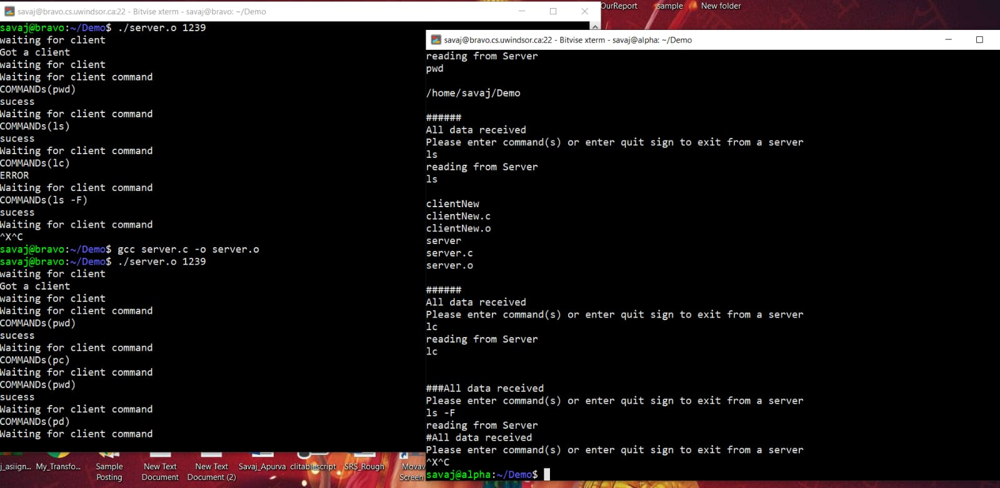

# Client Server Chat App

It is a Chat Application which handles multiple client request and has tested for all possible scenarios



---

## Features

```bash
➺ Client can send commands such as "ls, pwd" to the server and server send its response back to the client console.
➺ If incorrect command will be entered then Error message will be shown in the client console
➺ TCP SERVER Concurrent: multiple clients can be handled by this server
➺ Error handling when address Port/IP already in used
➺ Now second client no need to wait for first client to close by finishing its task.
➺ This server now handles n clients simultaneously.
➺ Here concurrency is achieved by creating a new child process which process each new client while parent continues to accepting new connections.
```

## Main Technologies

- [x] **[C]()**
- [x] **[Linux]()**
